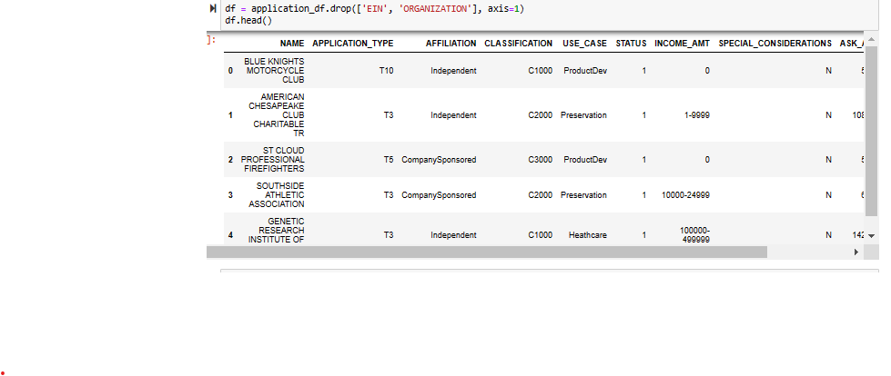
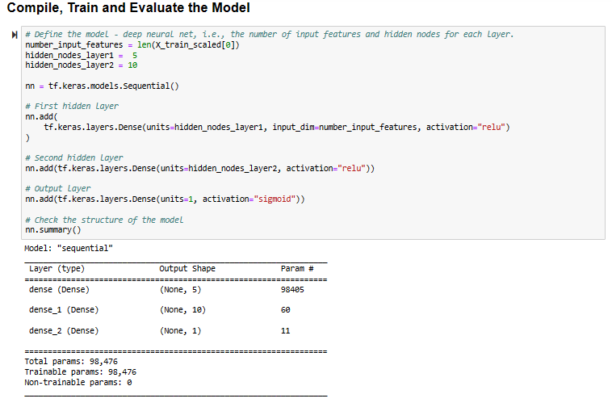
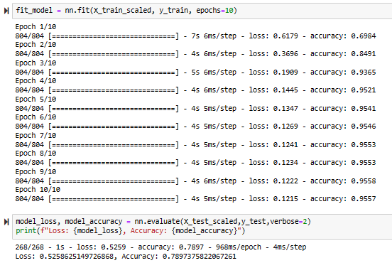

# Neural Network Model Report

### Overview:
A second learning deep learning model was created to improve the accuracy of the initial model. This was achieved in the following ways: creating bins for the 'NAME' column, decreasing the number of hidden nodes for each layer, and decreasing the number of epochs to 10. 

### Results: 

#### Data Preprocessing
- The target variable for the model is 'IS_SUCCESSFUL'
- The feature variable for the model is every other column in the dataframe besides 'IS_SUCCESSFUL'
- 'EIN' and 'ORGANIZATION were removed from the input data

#### Compiling, Training, and Evaluating the Model
- The number of input features uses were determined by the length of the x_trained_scaled data. The hidden nodes used were 5 and 10. The number of hidden layers were two with one output layer. The number of hidden nodes were decreased to improve the generalization of the model. 
- The target model performance was achieved with an accuracy of 0.789
- This accuracy was achieved by decrease the epochs and the number of hidden nodes. 

#### Summary
By completing the steps described above, the neural network model achieved an accuracy of 75%. Supervised machine learning may be a better model to solve this problem as it is helpful in predicting demographic data and displaying the data through regression models. 