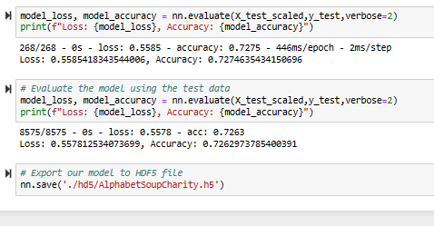

# deep-learning-challenge

## Overview 

In this repository, the user assisted a nonprofit foundation in creating a tool to select the best applicants for funding. A binary classificaiton model was created using the provided dataset.

## Preprocess the Data
The data was read into a Pandas DataFrame using Jupyter Notebook. Irrelevant columns were dropped from the dataframe. Rare categorical variables were binned and given a cutoff point.   
The datatypes were then transformed to encode categorical variables using pd.get_dummies(). The data was preprocessed into features array (X) and target array (y). The data was then split into training and testing datasets. A StandardScaler instance was creating to scale the data and fit it to the training data.  

## Compile, Train, and Evaluate the Model 
A neural network model was designed to create a binary classificaiton model to predict how successful an Alphabet Soup-funded organization will be with the given features. Input features and nodes were created using TensorFlow and Keras. The models loss and accuracy were determined after the model was compiled and trained. 
